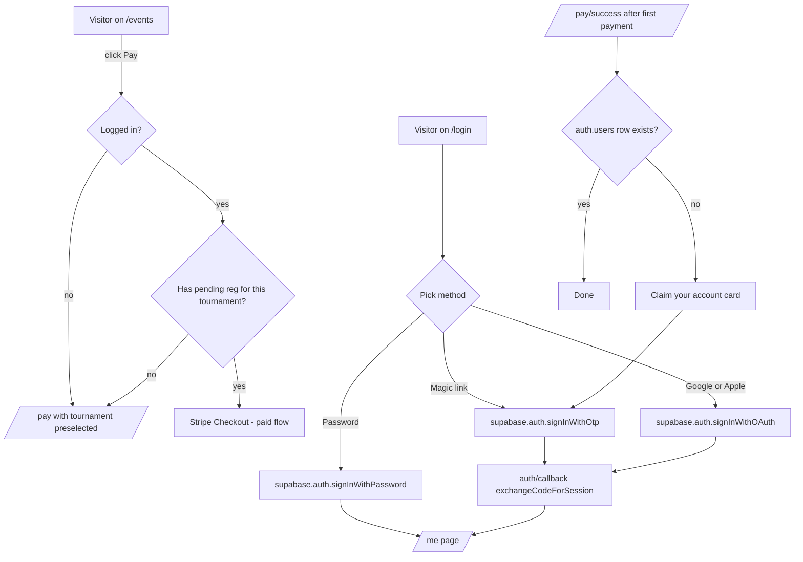

# HPS Phases 9–15 — Smart Pay + Full Player Auth

## What changes in this plan

This is a planning/rules update, not a code change. It rewrites the single file `[.cursor/rules/hps-phases.mdc](.cursor/rules/hps-phases.mdc)` so the next batch of sessions can be opened cleanly without re-deriving context.

The rewrite keeps:

- The Working Agreement (one phase per turn, plan-first, additive migrations, no emojis, `FOLLOWUPS.md` discipline, strict TS).
- The "Admin auth stays untouched" guarantee.
- The end-of-phase report template.

The rewrite changes:

- Phases 0–8 are collapsed into a short "Completed" preamble — they ship reality, not a roadmap.
- The "Current confirmed problems" list is replaced with the two remaining problems the user just flagged.
- The North Star gets a second line about player login.
- Phases 9–15 are added below.

## North Star (updated)

> 1. A returning, logged-in player can submit `/register` and reach the payment link in ≤3 clicks and ≤30s, with no DocuSeal redirect when a non-expired waiver of the matching type is on file. (unchanged)
> 2. An admin can open any tournament and immediately see roster + payment status + waiver status per player. (unchanged)
> 3. **(new)** Any player can sign in via magic link, password, OR Google/Apple in ≤2 clicks; sessions persist across visits; the right "Sign in" / "My account" CTA is always visible in the header; and someone who pays without a prior account is offered a one-click way to claim it from the success page.
> 4. **(new)** "Pay Entry Fee" on any tournament card lands the user on a payment screen pre-scoped to that exact tournament — and if they are logged in with a pending registration for it, jumps straight to Stripe Checkout.

## Stack updates to record in the rules header

- `@supabase/ssr` is installed and in active use (added in Phase 6) — no longer "anticipated".
- Supabase Auth is the only player-auth surface. Admin auth (HMAC cookie via `src/lib/app-signing.ts`) is still untouched and parallel.
- Phases 9–15 require ZERO new top-level npm deps. Everything is either (a) Supabase dashboard config (SMTP, OAuth providers, redirect URLs), (b) calls into the existing `@supabase/supabase-js` / `@supabase/ssr` surface, or (c) plain Tailwind + lucide-react UI.
- New env vars only — no new packages. Anticipated: `RESEND_API_KEY` or equivalent SMTP creds set inside Supabase Auth dashboard (not read by our code directly).

## What NOT to do in Phases 9–15

- Do not touch `src/lib/app-signing.ts` or `AdminGate`. Admin auth stays as-is.
- Do not install new npm packages without explicit approval.
- Do not migrate existing `contacts` rows into `auth.users` en masse. The "contacts joined by email" pattern from `src/lib/player-auth.ts` stays — we only enrich it.
- No destructive migrations.

---

## Phase 9 — Smart pay redirect (tournament-aware payment context)

**Goal:** Clicking "Pay Entry Fee" on any tournament card or page lands the user on a payment screen scoped to that tournament. Logged-in players with an unpaid registration jump straight to Stripe.

**Files touched**

- `[src/components/shared/TournamentCard.tsx](src/components/shared/TournamentCard.tsx)` — append `?tournament=<slug>` to the pay link.
- `[src/app/events/[slug]/page.tsx](src/app/events/[slug]/page.tsx)` — same.
- `[src/components/shared/FeaturedTournamentCard.tsx](src/components/shared/FeaturedTournamentCard.tsx)` — same.
- `[src/app/pay/page.tsx](src/app/pay/page.tsx)` — read `?tournament=<slug>` and preselect; thin Server-Component wrapper that does the smart-redirect server-side before the client form mounts.
- `[src/lib/tournaments.ts](src/lib/tournaments.ts)` — add `getTournamentBySlugForPay(slug)` if not already present.
- `[src/app/api/pay/options/route.ts](src/app/api/pay/options/route.ts)` — verify it still returns enough metadata for preselect.

**Smart-redirect logic (server-side, in `/pay`)**

1. If `?tournament=<slug>` resolves to a tournament with `payments_open=true`:
2. AND `getCurrentPlayer()` returns a user,
3. AND that user has a `registrations` row for this tournament with `payment_status='pending'`,
4. Mint a fresh `payToken` via `createPayResumeToken(registration.id)` and redirect to `/pay?registrationId=<id>&payToken=<token>` (current paid-flow path).
5. Otherwise render the existing `/pay` form with the tournament preselected.

**No migrations.**

---

## Phase 10 — Auth provider configuration & email deliverability

**Goal:** Magic-link emails actually arrive in production, and Site URL / Redirect URLs are correct. Mostly Supabase dashboard work + docs.

**Files touched**

- `[docs/AUTH.md](docs/AUTH.md)` — add a "Production checklist" section.
- `docs/AUTH-CONFIG.md` (new) — step-by-step Supabase dashboard checklist (Site URL, Redirect URLs, Email templates, SMTP). One markdown file.
- `[src/app/login/MagicLinkForm.tsx](src/app/login/MagicLinkForm.tsx)` — surface a clearer "didn't get it?" affordance with a 60s resend cooldown.
- New: `src/app/api/admin/diagnostics/auth/route.ts` — admin-only GET that probes Supabase Auth (project URL reachable, anon-key valid). Used to confirm config in prod.
- New (optional): `src/app/admin/diagnostics/page.tsx` — admin-only page that calls the route above.

**No code dep additions. No migrations.**

---

## Phase 11 — Password sign-in & password recovery

**Goal:** Players can choose magic link OR password. Existing magic-link users can add a password from `/me`.

**Files touched**

- `[src/app/login/page.tsx](src/app/login/page.tsx)` + `[src/app/login/MagicLinkForm.tsx](src/app/login/MagicLinkForm.tsx)` — add a tabbed UI: "Magic link" / "Password". Default to magic link.
- New: `src/app/login/PasswordForm.tsx` — uses `supabase.auth.signInWithPassword`.
- New: `src/app/login/forgot-password/page.tsx` + `src/app/login/forgot-password/ForgotPasswordForm.tsx` — `supabase.auth.resetPasswordForEmail`.
- New: `src/app/auth/reset/page.tsx` — landing page for the recovery link; updates password via `supabase.auth.updateUser({ password })`.
- New: `src/app/me/security/page.tsx` + `SecurityForm.tsx` — set/change password from inside `/me`.
- `[src/app/auth/callback/route.ts](src/app/auth/callback/route.ts)` — verify it handles the recovery `type=recovery` code path (or add a small branch).
- `[src/middleware.ts](src/middleware.ts)` — extend `/me/`* protection to `/me/security`.

**No migrations.**

---

## Phase 12 — OAuth: Google + Apple

**Goal:** "Continue with Google" and "Continue with Apple" on `/login`.

**Files touched**

- `[src/app/login/page.tsx](src/app/login/page.tsx)` — add provider buttons above the email form.
- New: `src/app/login/OAuthButtons.tsx` — calls `supabase.auth.signInWithOAuth({ provider, options: { redirectTo: callbackUrl } })`.
- `[src/app/auth/callback/route.ts](src/app/auth/callback/route.ts)` — confirm the existing `exchangeCodeForSession` path also handles OAuth; add provider-aware error messages.
- `[src/lib/player-auth.ts](src/lib/player-auth.ts)` — when lazily inserting a new `contacts` row, prefer `user.user_metadata.full_name` / `given_name` / `family_name` that OAuth providers set.
- `[docs/AUTH-CONFIG.md](docs/AUTH-CONFIG.md)` — Google + Apple provider setup steps (callback URLs, client IDs).

**Conflict policy:** if a Google user signs in with an email that already exists as a magic-link/password user, Supabase Auth will link automatically when "Confirm Email" is enforced. Document this behavior; do not fork identity.

**No migrations.**

---

## Phase 13 — Account claim for post-checkout players

**Goal:** Someone who pays for the first time without ever logging in is offered a one-click account claim. Closes the phase 14loop between registrations and the player-account world.

**Files touched**

- `[src/app/pay/success/page.tsx](src/app/pay/success/page.tsx)` — after the success copy, if `getCurrentPlayer()` is null but the matching `contacts` row exists, show a "Claim your account" card that calls Supabase `signInWithOtp` (or a password set-up) with the email already filled.
- New: `src/app/auth/claim/page.tsx` — landing if they click an emailed claim link.
- `[src/app/api/stripe/webhook/route.ts](src/app/api/stripe/webhook/route.ts)` — on first paid registration for an email with no `auth.users` row, fire a one-off claim email via Supabase Auth's `inviteUserByEmail` admin call OR a `resetPasswordForEmail`-style nudge. (Admin client only.)
- `[src/lib/player-auth.ts](src/lib/player-auth.ts)` — small helper `hasAuthUserForEmail(email)` using `supabase.auth.admin.listUsers({ email })`.

**Migration:** none. The "claim status" is derived from `contacts.email` ↔ `auth.users.email`.

---

## Phase 14 — Header + post-login UX polish

**Goal:** Header always shows the right CTA. `/me` is genuinely the player's home base.

**Files touched**

- `[src/components/layout/header-client.tsx](src/components/layout/header-client.tsx)` — replace the static "Sign in" / "Account" link with a small dropdown when authed (Profile, My registrations, Sign out). Keep mobile sheet behavior.
- `[src/components/layout/header.tsx](src/components/layout/header.tsx)` (if exists) — pass `displayName` in addition to `isAuthed`.
- `[src/app/me/page.tsx](src/app/me/page.tsx)` — link to `/me/security` (added in Phase 11) and surface the connected providers ("Signed in with Google", "Password set", etc.).
- New: small `src/components/layout/AccountMenu.tsx` for the dropdown (client component, accessible).

**Performance note:** Address followup `[phase 6] header now does a Supabase auth.getUser() on every render` — either cache via `unstable_cache` keyed on the access-token cookie or switch the header to a tiny client component that hits `/api/me/status`. Pick whichever lands cleanest in this phase.

**No migrations.**

---

## Phase 15 — Auth hardening, docs, and acceptance test pass

**Goal:** Lock the auth surface, document the final state, and run the North Star end-to-end.

**Files touched**

- `[docs/AUTH.md](docs/AUTH.md)` — rewrite to reflect the post-Phase-14 reality (magic link + password + OAuth + claim + dropdown header).
- New: `docs/AUTH-RUNBOOK.md` — operator runbook (rotate provider secrets, regenerate Supabase service-role key, common email-deliverability failures, dashboard checklist).
- New: `scripts/smoke-auth.ts` — non-destructive script that walks each sign-in method against a test email (skipped in CI unless `AUTH_SMOKE=1`).
- `[src/middleware.ts](src/middleware.ts)` — confirm `/me/`*, `/auth/*` route policy is exactly what we documented; tighten if drift was introduced in 11–14.
- `[FOLLOWUPS.md](FOLLOWUPS.md)` — review and close anything from Phases 9–14 that's actually done.

**Acceptance tests to run manually (numbered checklist will live in the rules file):**

1. Magic link end-to-end against a fresh email; lands on `/me`.
2. Password sign-in for the same email (set in `/me/security` first).
3. Google OAuth sign-in for the same email; auth.users row stays single.
4. Apple OAuth sign-in.
5. Forgot password → reset → sign-in.
6. Pay flow from a tournament card while logged-in: lands directly on Stripe Checkout.
7. Pay flow from a tournament card while logged-out: lands on `/pay` with that tournament preselected.
8. Brand-new email pays through Stripe Checkout, then claims account from `/pay/success`.

**No migrations.**

---

## Mermaid: the final auth + pay flow we're targeting

---

## Rollback for the rules file

Single file: `git checkout HEAD -- .cursor/rules/hps-phases.mdc` restores the prior version. No DB or runtime impact.